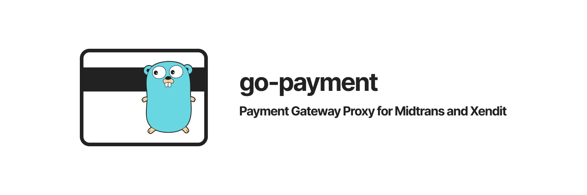

<!-- markdownlint-disable MD014 MD024 MD026 MD033 MD036 MD041 -->

<div align='center'>



</div>

Payment module used as proxy for multiple payment gateways. Currently it only supports [Midtrans SNAP](https://snap-docs.midtrans.com/) and Xendit [Ewallet](https://xendit.github.io/apireference/#ewallets) and [XenInvoice](https://xendit.github.io/apireference/#invoices). Support for other channels will be added incrementally.

> This payment proxy is a payment service I used for my [personal site](https://imrenagi.com/donate). Thinking that this might be useful to help other people so that they can start accept money ASAP, so I decided to make this module open source.

---

<details>
<summary><b>View table of contents</b></summary><br/>

- [Payment Channels Supported](#payment-channels-supported)
- [Why you should use this payment proxy?](#why-you-should-use-this-payment-proxy)
- [Current Limitations](#current-limitations)
- [Implemented Channels](#implemented-channels)
- [Getting Started](#getting-started)
  - [Payment Gateway Registration](#payment-gateway-registration)
    - [Midtrans](#midtrans)
    - [Xendit](#xendit)
    - [Midtrans VS Xendit Onboarding](#midtrans-vs-xendit-onboarding)
  - [Payment Gateway Callback](#payment-gateway-callback)
    - [Midtrans](#midtrans-1)
    - [Xendit](#xendit-1)
  - [Application Secret](#application-secret)
    - [Database](#database)
    - [Midtrans Credential](#midtrans-credential)
    - [Xendit Credential](#xendit-credential)
  - [Configuration File](#configuration-file)
  - [Mandatory Environment Variables](#mandatory-environment-variables)
- [Example Code](#example-code)
- [API Usage](#api-usage)
  - [POSTMAN JSON](#postman-json)
  - [List of payment methods](#list-of-payment-methods)
    - [Request](#request)
    - [Response](#response)
  - [Generating New Invoice](#generating-new-invoice)
    - [Request](#request-1)
    - [Response](#response-1)
    - [For Midtrans Payment Channel](#for-midtrans-payment-channel)
    - [For Xendit Payment Channel](#for-xendit-payment-channel)
- [Contributing](#contributing)
- [License](#license)

</details>

---

## Payment Channels Supported

In general, this payment proxy can support payment through this following channels:

- Credit card payment with/without installment
- Ewallet (GoPay, OVO, Dana, LinkAja)
- Retail Outlet (Alfamart, Alfamidi, Dan+Dan)
- Cardless Credit (Akulaku)
- Bank Transfer via Virtual Account (BCA, BNI, Mandiri, Permata, Other Bank). BRI channel is coming.

> :heavy_exclamation_mark: Support for recurring payment will be added soon!

## Why you should use this payment proxy?

- If you are planning to use Midtrans SNAP and Xendit Invoice as the UI for the payment, you are strongly encouraged to use this proxy because it supports both UIs.
- This proxy helps you managing the payment gateway used for each channel. It internally connects to both payment gateway as you need, in no time. What your API user knows is only one single API to generate `Invoice`
- This proxy helps you seemlesly switch the gateway for a payment channel whenever one of them is not functioning properly/down for maintenance. For instance, Bank Transfer by VA, are supported by Midtrans and Xendit. If Midtrans VA is going south, you can easily switch the gateway to Xendit simply by updating the configuration file.
- You can choose whether to absorb the admin/installment fees by yourself or to off load it to your user by changing the payment configuration written in yaml.
- This proxy can generate `Invoice` storing informations about the customer info, item, payment method selected, and its state. `Invoice` state will change over the time depends on the transaction status callback sent by payment gateway.
- You can opt-in to store payment notification callback to your database. Currently it only stores midtrans transaction status. Support for xendit will be added soon.

## Current Limitations
1. For simplify the query creation for database join, I use [gorm.io](https://gorm.io/) as the ORM library. The repository interfaces are provided indeed. However, default implementations with [gorm.io](https://gorm.io/) for several entities are provided in `datastore/mysql` package.
1. This proxy is not made for supporting all use cases available out there. It's hard requirement is just so that people can accept payment with as low effort as possible without need to worry about custom UI flow.
1. No callback trigger at least of now once the payment manager is done procesing this request. This will be the next priority of the next release. This issue is documented [here](https://github.com/imrenagi/go-payment/issues/5)

## Implemented Channels

This tables shows which payment channels that has been implemented by this proxy.

:white_check_mark: : ready

:heavy_exclamation_mark: : in progress

:x: : not yet supported natively by payment gateway

| Channels                        | Midtrans                            | Xendit                   |
| ------------------------------- | ----------------------------------- | ------------------------ |
| Credit Card without installment | :white_check_mark:                  | :white_check_mark:       |
| Credit Card with installment    | :white_check_mark:                  | :x:                      |
| BCA VA                          | :white_check_mark:                  | :white_check_mark:       |
| Mandiri VA                      | :white_check_mark:                  | :white_check_mark:       |
| BNI VA                          | :white_check_mark:                  | :white_check_mark:       |
| Permata VA                      | :white_check_mark:                  | :white_check_mark:       |
| Other VA                        | :white_check_mark:                  | :x:                      |
| BRI VA                          | :x:                                 | :white_check_mark:       |
| Alfamart, Alfamidi, Dan+Dan     | :white_check_mark:                  | :white_check_mark:       |
| QRIS                            | :white_check_mark: via Gopay Option | :x:                      |
| Gopay                           | :white_check_mark:                  | :x:                      |
| OVO                             | :x:                                 | :white_check_mark:       |
| DANA                            | :x:                                 | :white_check_mark:       |
| LinkAja                         | :x:                                 | :white_check_mark:       |
| Akulaku                         | :white_check_mark:                  | :x:                      |
| Kredivo                         | :x:                                 | :heavy_exclamation_mark: |

## Getting Started

Here some preparations that you might need before using this proxy.

### Payment Gateway Registration

This can be tricky. If you have personal business, this might be easier. If you have business entity (PT, CV, etc), there are some additional processes you have to follow and some documents that you have to provide. In this context, I will just assume that you have personal business like what I do: [imrenagi.com](https://imrenagi.com)

#### Midtrans

Please review this [page](https://midtrans.com/tentang-passport) before creating an account.

#### Xendit

Please visit this [registration page](https://dashboard.xendit.co/register/1) for creating an account.

#### Midtrans VS Xendit Onboarding

Here is the comparison between Midtrans and Xendit onboarding based on my onboarding experience.

| Criteria                                      | Midtrans                                                                                             | Xendit                                                                                                 |
| --------------------------------------------- | ---------------------------------------------------------------------------------------------------- | ------------------------------------------------------------------------------------------------------ |
| Document to provide for registration          | KTP, NPWP                                                                                            | KTP, NPWP                                                                                              |
| Cooperation Agreement (Perjanjian Kerja Sama) | Online Signing                                                                                       | Paper Signing and use Legalized Stamp                                                                  |
| Active channels after agreement is signed     | Gopay, Bank Transfer                                                                                 | Bank Transfer, Credit Card                                                                             |
| OVO, LinkAja, Dana activation                 | n/a                                                                                                  | Fill additional forms on the dashboard. Activation varies between weeks - months                       |
| Alfamart activation                           | Require additional request and midtrans review for the activation                                    | No need to be PT, CV. Just fill and sign additional form on the dashboard. Might take weeks or months. |
| Credit card activation                        | Require additional request and midtrans review for the activation                                    | Immediately activated after document sign                                                              |
| Disbursement feature                          | Not included on the same PKS. Need to contact IRIS team for new agreement, activation and onboarding | Immediately activated after document sign                                                              |
| Akulaku activation                            | Might require business entity (PT, CV)                                                               | n/a                                                                                                    |
| Kredivo activation                            | n/a                                                                                                  | Ask your account manager to activate this payment method                                               |
| API Documentation                             | Available                                                                                            | Available                                                                                              |
| Golang SDK                                    | Available                                                                                            | Available, but under development. Expect breaking changes in newer version                             |

### Payment Gateway Callback

Payment Gateway Callback is POST request sent by payment gateway to notify our backend about any changes happened with the payment. Either it is success, pending, or failed due to a reason. This proxy have it handled.

| Payment Channel                        | Callback URL Path                  |
| -------------------------------------- | ---------------------------------- |
| All payments through Midtrans SNAP     | `/payment/midtrans/callback`       |
| All payments through Xendit Invoice UI | `/payment/xendit/invoice/callback` |
| Xendit Dana                            | `/payment/xendit/dana/callback`    |
| Xendit LinkAja                         | `/payment/xendit/linkaja/callback` |

> For payment with OVO, the proxy does not directly call OVO Ewallet API, but it uses Xendit Invoice UI instead. Thus, all payment callback/notification about OVO go to Xendit Invoice callback `/payment/xendit/invoice/callback`.

#### Midtrans

To set your callback URL,

- Login to <https://dashboard.midtrans.com>
- Choose environment (Sandbox or Production)
- Click Settings > Configuration
- Set your **Payment Notification URL** with your server callback. For instance: `https://api.imrenagi.com/payment/midtrans/callback`
- Set your **Finish**, **Unfinish**, and **Error** redirect URL
- Click **Update**

#### Xendit

To set your callback URL,

- Login to <https://dashboard.xendit.co>
- Choose environment (Live or Test)
- Click Settings > Callbacks
- Set your callbacks for Invoices Paid. For instance: `https://api.imrenagi.com/payment/xendit/invoice/callback`
- Check option **Also notify my application when an invoice is expired**
- Click **Save and Test**

> LinkAja and DANA callback URL are not defined on xendit dashboard. Instead, they are given while the proxy is initiating the payment request to Xendit API. You can find the callback URL set on [linkaja.go](/gateway/xendit/linkaja.go) and [dana.go](/gateway/xendit/dana.go)

### Application Secret

Before using this application, you might need to update [secret.yaml](/example/server/secret.yaml) file containing application secret like database and payment gateway credential.

#### Database

For testing purpose, you can use mysql docker image to bootstrap a mysql database

```console
$ docker run --name some-mysql -e MYSQL_DATABASE=your-database-name -e MYSQL_USER=your-user -e MYSQL_PASSWORD=your-password -p 3306:3306 -d mysql:5.7
```

Then, please update the secret below with your database credential.

```yaml
db:
  host: "127.0.0.1"
  port: 3306
  username: "your-user"
  password: "your-password"
  dbname: "your-database-name"
```

#### Midtrans Credential

- Login to <https://dashboard.midtrans.com>
- Choose environment (Sandbox or Production)
- Click Settings > Access Keys
- Grab the credentials, and update the `secret.yaml`

```yaml
payment:
  midtrans:
    secretKey: "midtrans-server-secret"
    clientKey: "midtrans-client-key"
    clientId: "midtrans-merchant-id"
```

#### Xendit Credential

- Login to <https://dashboard.xendit.co>
- Choose environment (Live or Test)
- Click Settings > API Keys > Generate secret key
- Add key Name. Grant write permission for both **Money-in products**
- Take the generated API Keys and Verification Callback Token, update the `secret.yaml`

```yaml
payment:
  ...
  xendit:
    secretKey: "xendit-api-key"
    callbackToken: "xendit-callback-token"
```

### Configuration File

You can take a look sample configuration file named [payment-methods.yml](/example/server/payment-methods.yml). For instance:

```yaml
card_payment:
  payment_type: "credit_card"
  installments:
    - type: offline
      display_name: ""
      gateway: midtrans
      bank: bca
      channel: migs
      default: true
      active: true
      terms:
        - term: 0
          admin_fee:
            IDR:
              val_percentage: 2.9
              val_currency: 2000
              currency: "IDR"
        - term: 3
          installment_fee:
            IDR:
              val_percentage: 5.5
              val_currency: 2200
              currency: "IDR"
```

With above configuration, for installment `offline` with `bca`, you can apply this following fees to the invoice after user generates new invoice:

1. 2.9% + IDR 2000 admin fee for credit card transaction without any installment, or
1. 5.5% + IDR 2200 installment fee for credit card transaction with installment for 3 month tenure.

If you want to absorb the fee, you can simply set `val_percentage` and `val_currency` as `0`

If you only want to apply fee just either by using `val_pecentage` or `val_currency`, simply set the value to one of them and give `0` to the other. For instance:

```yaml
bank_transfers:
  - gateway: midtrans
    payment_type: "bca_va"
    display_name: "BCA"
    admin_fee:
      IDR:
        val_percentage: 0
        val_currency: 4000
        currency: "IDR"
```

> `admin_fee` and `installment_fee` are optional key.

### Mandatory Environment Variables

You need to set these mandatory environment variables to make sure this proxy to work.

```bash
# ENVIRONMENT can be either staging or prod
export ENVIRONMENT=staging #use prod for production
export LOG_LEVEL=DEBUG
export SERVER_BASE_URL="http://localhost:8080"
export WEB_BASE_URL="https://imrenagi.com"
export SUCCESS_REDIRECT_PATH="/donate/thanks"
export PENDING_REDIRECT_PATH="/donate/pending"
export FAILED_REDIRECT_PATH="/donate/error"
```

> `SUCCESS_REDIRECT_PATH` and `FAILED_REDIRECT_PATH` will be concatenated with `WEB_BASE_URL` to form redirect URL when they payment is completed or failed. For instance, take a look to this [success](https://imrenagi.com/donate/thanks) and [failed](https://imrenagi.com/donate/error) page.

## Example Code

To start using this module, you can try the example [server.go](/example/server/server.go)

```go
package main

import (
  "net/http"

  "github.com/gorilla/mux"
  "github.com/imrenagi/go-payment/datastore/inmemory"
  dsmysql "github.com/imrenagi/go-payment/datastore/mysql"
  "github.com/imrenagi/go-payment/gateway/midtrans"
  "github.com/imrenagi/go-payment/invoice"
  "github.com/imrenagi/go-payment/manage"
  "github.com/imrenagi/go-payment/server"
  "github.com/imrenagi/go-payment/util/db/mysql"
  "github.com/imrenagi/go-payment/util/localconfig"
  "github.com/rs/cors"
  "github.com/rs/zerolog/log"
)

func main() {

  secret, err := localconfig.LoadSecret("example/server/secret.yaml")
  if err != nil {
    panic(err)
  }

  db := mysql.NewGorm(secret.DB)
  db.AutoMigrate(
    &midtrans.TransactionStatus{},
    &invoice.Invoice{},
    &invoice.Payment{},
    &invoice.CreditCardDetail{},
    &invoice.LineItem{},
    &invoice.BillingAddress{},
  )

  m := manage.NewManager(secret.Payment)
  m.MustMidtransTransactionStatusRepository(dsmysql.NewMidtransTransactionRepository(db))
  m.MustInvoiceRepository(dsmysql.NewInvoiceRepository(db))
  m.MustPaymentConfigReader(inmemory.NewPaymentConfigRepository("example/server/payment-methods.yml"))

  srv := srv{
    Router:     mux.NewRouter(),
    paymentSrv: server.NewServer(m),
  }
  srv.routes()

  if err := http.ListenAndServe(":8080", srv.GetHandler()); err != nil {
    log.Fatal().Msgf("Server can't run. Got: `%v`", err)
  }

}
```

To run the application, simply use:

```console
$ go run example/server/server.go
```

> :heavy_exclamation_mark: If you want to accept payment callback from the payment gateway on your local computer for development purpose, consider to use [ngrok.io](https://ngrok.io) to expose your localhost to the internet and update the callback base URL in payment gateway dashboard and `SERVER_BASE_URL` accordingly.

## API Usage

Your client webservice can interact to at least 2 endpoints:

- GET all payment methods available
- POST generating new invoice

### POSTMAN JSON

You can download this POSTMAN json file to see how to use the api. [POSTMAN COLLECTION](/example/server/go-payment.postman_collection.json)

### List of payment methods

#### Request

If you want to get the estimated admin/installment fee for each payment methods, provice this GET request with optional `price` and `currency` query. Otherwise, it returns nil `admin_fee` and `installment_fee`

```http
GET /payment/methods?price=1000&currency=IDR
```

#### Response

```json
{
  "card_payment": {
    "payment_type": "credit_card",
    "installments": [
      {
        "display_name": "",
        "type": "offline",
        "bank": "bca",
        "terms": [
          {
            "term": 0,
            "admin_fee": {
              "value": 2029,
              "curency": "IDR"
            }
          }
        ]
      }
    ]
  },
  // ... redacted ...
  "ewallets": [
    {
      "payment_type": "gopay",
      "display_name": "Gopay",
      "admin_fee": {
        "value": 0,
        "curency": "IDR"
      }
    }
  ]
}
```

### Generating New Invoice

Use this endpoint to create a payment request to chosen payment channels and gateway.

#### Request

```http
POST /payment/invoices
```

```json
{
  "payment": {
    "payment_type": "ovo"
  },
  "customer": {
    "name": "John",
    "email": "foo@example.com",
    "phone_number": "089922222222"
  },
  "item": {
    "name": "Support Podcast",
    "category": "PODCAST",
    "merchant": "imrenagi.com",
    "description": "donasi podcast imre nagi",
    "qty": 1,
    "price": 80001,
    "currency": "IDR"
  }
}
```

> To create invoice with `credit_card` payment with/without installment, please take a look [POSTMAN COLLECTION](/example/server/go-payment.postman_collection.json)

#### Response

When you call endpoint above, server returns all invoice data. But, to proceed to the payment page you need to pay attention to `payment` object.

```json
{
  "payment": {
    "id": 48,
    "created_at": "2020-05-25T23:31:44.99873+07:00",
    "updated_at": "2020-05-25T23:31:44.99873+07:00",
    "deleted_at": null,
    "gateway": "xendit",
    "payment_type": "ovo",
    "token": "",
    "redirect_url": "https://invoice.xendit.co/web/invoices5ecbf2f0689543409347ec15",
    "transaction_id": "5ecbf2f0689543409347ec15"
  }
}
```

:heavy_exclamation_mark::heavy_exclamation_mark::heavy_exclamation_mark: Please note:

#### For Midtrans Payment Channel

- Value of `payment.gateway` will is always `midtrans`
- You can use `payment.token` to open snap window by using midtrans [snap.js](https://snap-docs.midtrans.com/#snap-js)
- If you want to use [Window Redirection](https://snap-docs.midtrans.com/#window-redirection), you can open a new browser tab by using url in `payment.redirect_url`

#### For Xendit Payment Channel

- Value of `payment.gateway` will is always `xendit`
- `payment.token` is always empty for all xendit provided payment channels
- You will always open `payment.redirect_url` in new browser tap for all payment methods provided by xendit. Including DANA, LinkAja, Kredivo, even Xendit Invoice.

## Contributing

No rules for now. Feel free to add issue first and optionally submit a PR. Cheers

## License

Copyright 2020 [Imre Nagi](./LICENSE)
